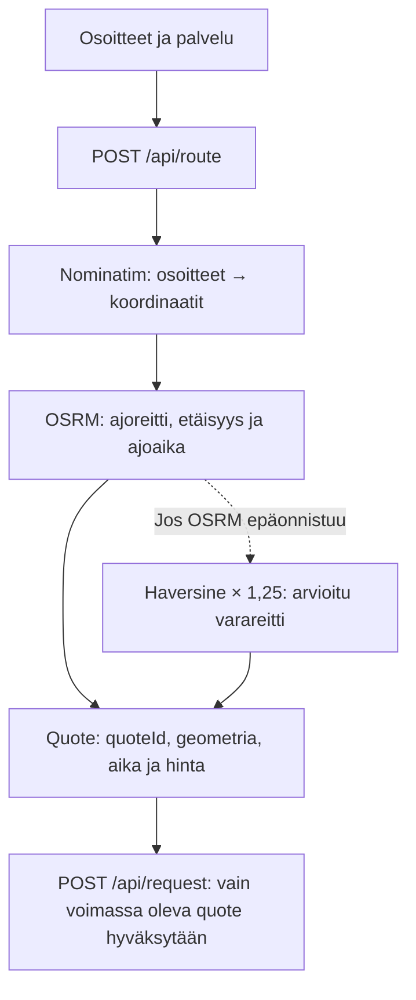
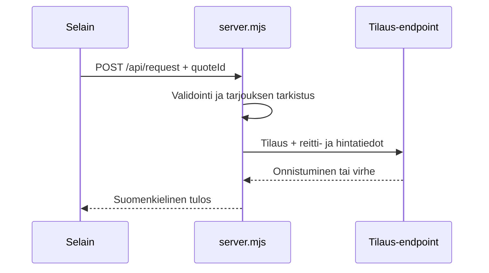

# Kotiva — nouto ja toimitus kotiovelle

Kotiva on suomenkielinen on-demand-kuljetussivusto. Koodista rakennettu 3D-avustaja
**Puhto** ohjaa asiakkaan kolmivaiheisen tilauksen läpi. Käyttöliittymässä on live-reittikartta,
osoitteisiin perustuva etäisyys- ja aika-arvio, dynaaminen kokonais-euroihin pyöristetty hinta
sekä palvelimella toimiva AI-yhdysportti.

Kaikki 3D-renderöinti tehdään koodista. Erillisiä 3D-malleja tai tekstuureja ei tarvita.

## Käynnistys

```bash
npm install
npm start       # http://localhost:3000
npm test        # headless-droidin ja tilojen savutesti
npm run build   # stagedaa runtime-tiedostot dist/-kansioon
```

Buildatun version voi palvella PowerShellissä näin:

```powershell
$env:KOTIVA_PUBLIC_DIR = "dist"
npm start
```

`npm run build` kopioi `dist/`-kansioon seitsemän selaimen runtime-tiedostoa. Three.js
ladataan jsDelivriltä import mapin kautta ja Leaflet ladataan UNPKG:stä. Molemmat vaativat
verkkoyhteyden selaimessa.

## Ympäristömuuttujat

| Muuttuja | Tarkoitus | Oletus |
| --- | --- | --- |
| `PORT` | HTTP-palvelimen portti | `3000` |
| `KOTIVA_PUBLIC_DIR` | Palveltava hakemisto; arvo `dist` käyttää buildia | lähdekansio |
| `KOTIVA_REQUEST_ENDPOINT` | Yrityksen tilauspyyntöjen vastaanottava endpoint | `https://formspree.io/f/xaeyljvb` → `info@kotiva.fi` |
| `KOTIVA_MAP_USER_AGENT` | Nominatim- ja OSRM-pyyntöjen tunniste | `kotiva/1.0 (route estimation; https://kotiva.local)` |
| `GEMINI_API_KEY`, `GROQ_API_KEY`, ... | AI-palveluntarjoajien avaimet | ei asetettu |

`PUHTOLA_PUBLIC_DIR` ja `PUHTOLA_REQUEST_ENDPOINT` ovat palvelimessa säilytettyjä legacy-aliasia,
mutta uusissa ympäristöissä käytä `KOTIVA_*`-nimiä. API-avaimia ei koskaan välitetä selaimelle.

## Reititys, kartta ja dynaaminen hinnoittelu

Kotiva laskee reitin vain asiakkaan nimenomaisesta pyynnöstä, kun nouto- ja toimitusosoite
on annettu. Selain kutsuu palvelimen omaa `POST /api/route` -päätepistettä. Osoitteita ei
geokoodata selaimessa eikä Nominatimia käytetä autocomplete-hakuun.



### Nykyiset reittipalvelut

| Osa | Palvelu | Käyttö |
| --- | --- | --- |
| Geokoodaus | Nominatim / OpenStreetMap | Nouto- ja toimitusosoitteet koordinaateiksi |
| Ajoreitti | OSRM demo-palvelu | Ajoetäisyys, arvioitu ajoaika ja GeoJSON-geometria |
| Kartan käyttöliittymä | Leaflet 1.9.4 | Reittiviiva, noutomerkki ja toimitusmerkki |
| Karttalaatat | OpenStreetMap | Kartan taustalaatat ja attribuutio |

`/api/route` vastaanottaa JSON-rungon:

```json
{
  "service": "Pakettikuljetus",
  "pickupAddress": "Mannerheimintie 1, Helsinki",
  "dropoffAddress": "Keilaranta 1, Espoo"
}
```

Onnistunut vastaus sisältää muun muassa:

- `quoteId` — lyhytikäisen tarjouksen tunniste
- `service`, `pickupAddress` ja `dropoffAddress` — alkuperäiset käyttäjän arvot
- `pickup` ja `dropoff` — geokoodatut koordinaatit
- `distanceMeters` ja `distanceKm` — reitin etäisyys
- `durationSeconds` — arvioitu ajoaika
- `priceEuros` ja `price` — palvelimen laskema hinta, esimerkiksi `23 €`
- `geometry` — Leafletille muunnettava GeoJSON-koordinaattilista
- `source` — `osrm` tai `estimate`
- `expiresAt` — tarjouksen vanhenemisaika

Tarjoukset säilytetään palvelimen muistissa 30 minuuttia. Geokoodauksen välimuisti kestää
10 minuuttia, ja Nominatim-kutsut jonotetaan siten, että peräkkäisten kutsujen väli on vähintään
1,1 sekuntia. OSRM:n häiriössä käytetään Haversine-etäisyyttä kertoimella 1,25 ja 32 km/h:n
arvioitua keskinopeutta. Käyttöliittymä kertoo asiakkaalle, kun kyseessä on arvioitu varareitti.

### Hinnoittelusäännöt

Hinta lasketaan palvelimella `booking.js`-tiedoston `calculateDeliveryPrice()`-funktiolla.
Ensimmäiset 2 km sisältyvät perushintaan. Sen jälkeen käytetään kaavaa:

```text
lisäkilometrit = max(0, etäisyys_km − 2)
hinta_euroina = max(perushinta, ceil(perushinta + lisäkilometrit × hinta_per_km))
```

| Palvelu | Perushinta | Sisältyvä matka | Lisämatkan kerroin |
| --- | ---: | ---: | ---: |
| Pikatoimitus | 9 € | 2 km | 2,2 €/km |
| Pakettikuljetus | 12 € | 2 km | 1,6 €/km |
| Kauppakyyti | 15 € | 2 km | 1,8 €/km |
| Yrityskuljetus | 20 € | 2 km | 1,4 €/km |

Julkinen hinta pyöristetään aina ylöspäin kokonaiseksi euroksi: esimerkiksi `23 €`, ei
`22,40 €`. Sisäinen etäisyys säilytetään yhden desimaalin tarkkuudella.

### Tarjouksen validointi

Asiakas ei voi siirtyä aikaikkunan valintaan ilman ajantasaista reittitarjousta. Selain tarkistaa,
että tarjous vastaa nykyistä palvelua ja molempia osoitteita. Palvelin tarkistaa samat arvot sekä
`quoteId`-tunnisteen ja vanhenemisajan ennen `POST /api/request` -pyynnön välittämistä.

Jos tarjous puuttuu, vanhenee tai ei vastaa osoitteita, palvelin palauttaa HTTP 409 -vastauksen:

```text
Reittihinta on vanhentunut. Laske reitti ja hinta uudelleen.
```

Osoitteen tai palvelun muuttaminen mitätöi selainpuolen tarjouksen ja piilottaa vanhan kartan
sekä hinnan. Näin aiemman osoiteparin hintaa ei voi käyttää uuden tilauksen lähettämiseen.

## Tuotantoon siirtyminen

Nykyiset Nominatim- ja OSRM-julkispalvelut sopivat prototyyppiin, mutta niillä ei ole Kotivan
käyttöön tarkoitettua tuotanto-SLA:ta. Tuotantoon siirryttäessä:

1. Valitse hallittu tai itsehostattu geokoodaus-, reititys- ja karttalaattapalvelu, jonka
   käyttöehdot, kiintiöt ja SLA kattavat odotetun liikenteen.
2. Pidä palveluntarjoajien kutsut palvelimella. Älä vie API-avaimia selaimeen tai URL:n
   query-parametreihin. Säilytä avaimet palvelun salaisuuksien hallinnassa.
3. Korvaa `server.mjs`-tiedoston `queueNominatim()` ja `getRoute()` uuden palveluntarjoajan
   SDK:lla tai HTTP-rajapinnalla. Säilytä aikakatkaisut, välimuisti, rate limiting ja fallback-
   käyttäytyminen.
4. Vaihda `app.js`-tiedoston Leafletin `tileLayer` tuotantopalvelun URL:iin ja säilytä kartan
   käyttöehdoissa vaadittu tekijänoikeus- ja attribuutioteksti.
5. Päätä, hyväksytäänkö `source: "estimate"` -varareitti hinnan perusteeksi. Turvallisempi
   tuotantokäytäntö on merkitä arvio näkyvästi tai vaatia uusi laskenta ennen tilausta.
6. Lisää lokitus ja hälytykset geokoodausvirheille, fallback-reiteille, 429/5xx-virheille,
   palvelukiintiöille, poikkeaville hinnoille ja vanhentuneille tarjouksille.
7. Testaa realistisella osoitejoukolla ja virhetilanteilla: tuntematon osoite, sama osoite,
   reitittimen aikakatkaisu, palveluntarjoajan rajoitus, vanhentunut `quoteId` ja osoitteen
   muuttaminen tarjouksen jälkeen.
8. Tarkista tietosuoja. Osoitteet ovat henkilötietoon yhdistettävää tilaustietoa: rajaa lokit,
   määritä säilytysajat ja lähetä kolmansille osapuolille vain tarpeelliset tiedot.
9. Ota HTTPS, tuotantolokiikka, valvonta, varmuuskopiot ja prosessin hallittu uudelleenkäynnistys
   käyttöön ennen julkista julkaisua.

Esimerkki tuotantoympäristön palveluasetuksista:

```powershell
$env:PORT = "3000"
$env:KOTIVA_PUBLIC_DIR = "dist"
$env:KOTIVA_REQUEST_ENDPOINT = "https://formspree.io/f/oma-tuotanto-endpoint"
$env:KOTIVA_MAP_USER_AGENT = "kotiva/1.0 (route estimation; https://www.example.fi)"
npm start
```

Kun julkiset karttapalvelut vaihdetaan tuotantopalveluun, päivitä myös käyttöehdot,
attribuutio, välimuistipolitiikka ja palveluntarjoajan edellyttämät tunnisteet.

## Käyttöliittymä ja varausohjaus

Varaus etenee kolmessa vaiheessa:

| Askel | Kentät ja toiminta |
| --- | --- |
| 1 Palvelu | `Pikatoimitus`, `Pakettikuljetus`, `Kauppakyyti` tai `Yrityskuljetus` |
| 2 Reitti | nimi, puhelin, nouto-osoite, toimitusosoite, sähköposti, lähetyksen koko ja reittilaskenta |
| 3 Aika | päivämäärä, vapaa aikaikkuna, lisätiedot ja lopullinen tarjous ennen vahvistusta |

Kaikki palvelukortit pysyvät näkyvissä myös myöhemmissä vaiheissa. Palvelun vaihtaminen
säilyttää kirjoitetut tiedot mutta mitätöi reittitarjouksen, jolloin uusi hinta lasketaan
valitulle palvelulle.

Vahvistus tallentaa tilauksen ensin paikalliseen `localStorage`-kirjaan, jotta aikaikkuna ei
varata selaimessa kahdesti. Palvelin on kuitenkin lähetettyjen tilausten lähde; jos ulkoinen
lähetys epäonnistuu, paikallinen varaus vapautetaan ja käyttäjälle näytetään virhe.

## Tilauspyynnöt yrityksen postiin

Vahvistettu kuljetuspyyntö lähetetään palvelimen kautta `KOTIVA_REQUEST_ENDPOINT`-osoitteeseen.
Nykyinen Formspree-endpoint on `https://formspree.io/f/xaeyljvb`, jonka vastaanottajaksi on
määritetty `info@kotiva.fi`. Formspree hallitsee lopullista sähköpostiohjausta; tuotannossa
endpoint kannattaa tarvittaessa määrittää ympäristömuuttujalla.



Palvelin rajaa kentät, tiivistää whitespace-merkit, tarkistaa palvelun, yhteystiedot,
osto- ja toimitusosoitteet, päivämäärän, aikaikkunan ja sähköpostiosoitteen. Pyyntöön välitetään
myös `quoteId`, `distanceKm`, `estimatedDurationMinutes` ja `quotedPrice`.

Selain ei saa tietää ulkoisen endpointin asetuksia. Honeypot-kenttä estää täytettyjen
robottipyyntöjen välittämisen, ja API:ssa on per-IP-nopeusrajoitus.

## AI-yhdysportti

`ai-providers.mjs` rekisteröi useita palveluntarjoajia ja kokeilee seuraavaa saatavilla olevaa
palvelua, jos edellinen epäonnistuu. Tuettuja vaihtoehtoja ovat muun muassa Pollinations,
Google Gemini, Groq, OpenRouter, Hugging Face, Cloudflare Workers AI, Mistral, Cohere,
OpenAI-yhteensopiva endpoint ja paikallinen Ollama.

- Avaimet asetetaan palvelimen ympäristöön, eivätkä ne pääse selaimelle.
- `/api/config` raportoi vain palveluiden valmiustilan.
- Chat käyttää Server-Sent Events -virtaa, kun palveluntarjoaja tukee sitä.
- Pyyntörunko on enintään 12 000 merkkiä, viestejä on 1–8 ja yhden viestin sisältö voi olla
  enintään 1 200 merkkiä.
- Nopeusrajoitus on 20 pyyntöä minuutissa per IP.

Esimerkki:

```powershell
$env:GEMINI_API_KEY = "..."
$env:GROQ_API_KEY = "..."
npm start
```

## Visuaalinen toteutus ja suorituskyky

Käyttöliittymä on oletuksena vaalea, ja teeman vaihto käyttää `style.css`-tiedoston keskitettyjä
tokeneita. 3D-lava kunnioittaa vähennetyn liikkeen asetusta ja mukauttaa laatua laitteen mukaan.

Aiemmin tunnistetut suorituskykykorjaukset ovat edelleen mukana:

- animaatiosilmukka käyttää uudelleenkäytettäviä pose-tauluja ja apuvektoreita
- `pointermove`-tapahtumien raycast tehdään animaatiokehyksessä
- bloom kytkeytyy pois heikolla GPU:lla
- heijastus- ja varjokartta skaalautuvat mukautuvan laadun mukana
- HUD-päivitys on rytmitetty eikä kirjoita DOMiin joka ruudulla
- lava pysähtyy, kun se ei ole näkyvissä
- ääni käyttää pehmeitä sini- ja kolmioaaltomuotoja, limitteriä ja matalaa low-pass-suodatusta

## Tiedostot

| Tiedosto | Rooli |
| --- | --- |
| `index.html` | HTML-rakenne, teeman ensimaalaus, Three.js-import map ja Leaflet-assets |
| `style.css` | design-tokenit, komponentit, reitti-/karttatyylit ja responsiivisuus |
| `app.js` | DOM-kytkennät, chat, puhe, varausohjaus, reittikutsu ja Leaflet-kartta |
| `robot.js` | proseduraalinen Puhto-droidi, tilat, animaatio ja telemetria |
| `stage.js` | 3D-renderöijä, kamera, valaistus, lattia, bloom ja teemat |
| `booking.js` | palvelut, hinnoittelu, aukioloajat, localStorage-varaukset ja validointi |
| `sound.js` | proseduraaliset Web Audio -äänet ja ambient-ääni |
| `ai-providers.mjs` | AI-palveluntarjoajien rekisteri, fallback-logiikka ja stream-lukija |
| `server.mjs` | staattinen palvelin, chat-, route- ja request-API:t sekä nopeusrajoitus |
| `build.mjs` | kopioi seitsemän runtime-tiedostoa `dist/`-kansioon |
| `test-robot.mjs` | headless-savutesti droidille, tiloille, NaN-arvoille ja telemetrialle |
| `tmp-route-check.mjs` | paikallinen desktop/mobile-selaintarkistus reititys- ja varauspolulle |

## Tarkistuskomennot

```bash
npm test
npm run build
```

Route- ja UI-tarkistuksessa varmistetaan lisäksi:

- `/api/route` palauttaa etäisyyden, ajan, quote ID:n ja kokonais-eurohinnan
- vaiheesta 2 ei voi jatkaa ennen reitin laskemista
- osoitteen muutos mitätöi vanhan tarjouksen
- kartta, reittiviiva ja hinta näkyvät desktop- ja mobiilinäkymissä
- vaakasuuntaista ylivuotoa tai selainkonsolin virheitä ei synny

## Huomioita

- Asiakaspuolen tekstit, puhe ja mikrofonin kieli ovat suomea (`fi-FI`).
- Kartassa näytetään OpenStreetMapin edellyttämä attribuutio.
- Julkiset Nominatim- ja OSRM-palvelut ovat prototyyppiriippuvuuksia, eivät tuotannon SLA-palveluja.
- `npm test` ei tarvitse selainta tai GPU:ta; selainpolun tarkistus käyttää erillistä Chrome-pohjaista
  `tmp-route-check.mjs`-testiä.
